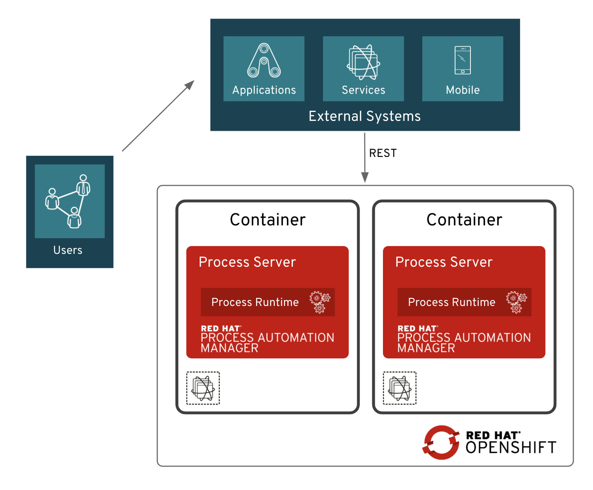
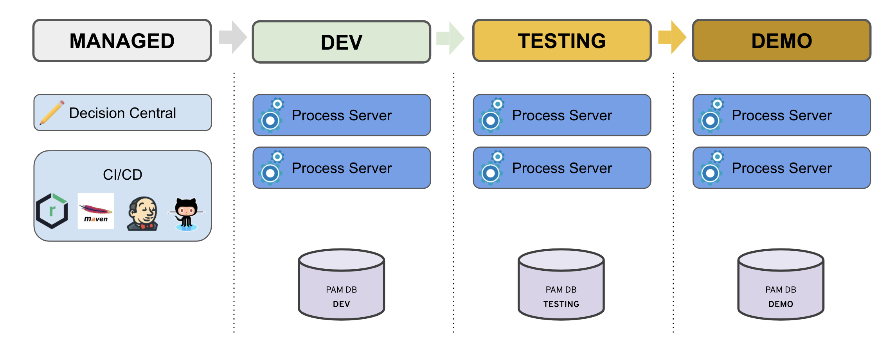
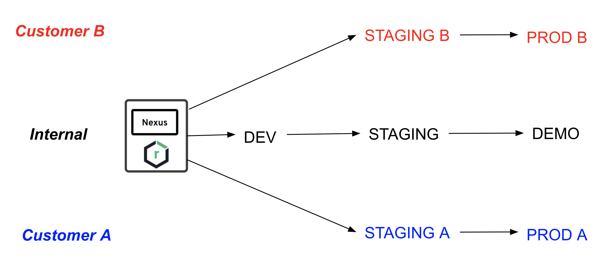
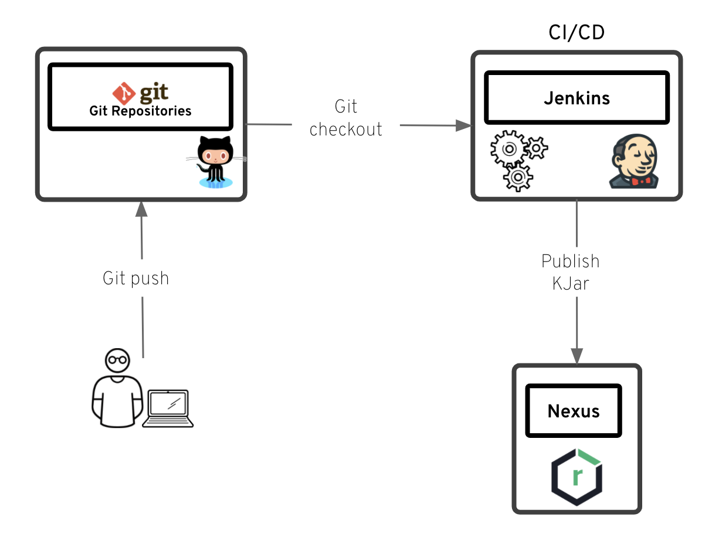
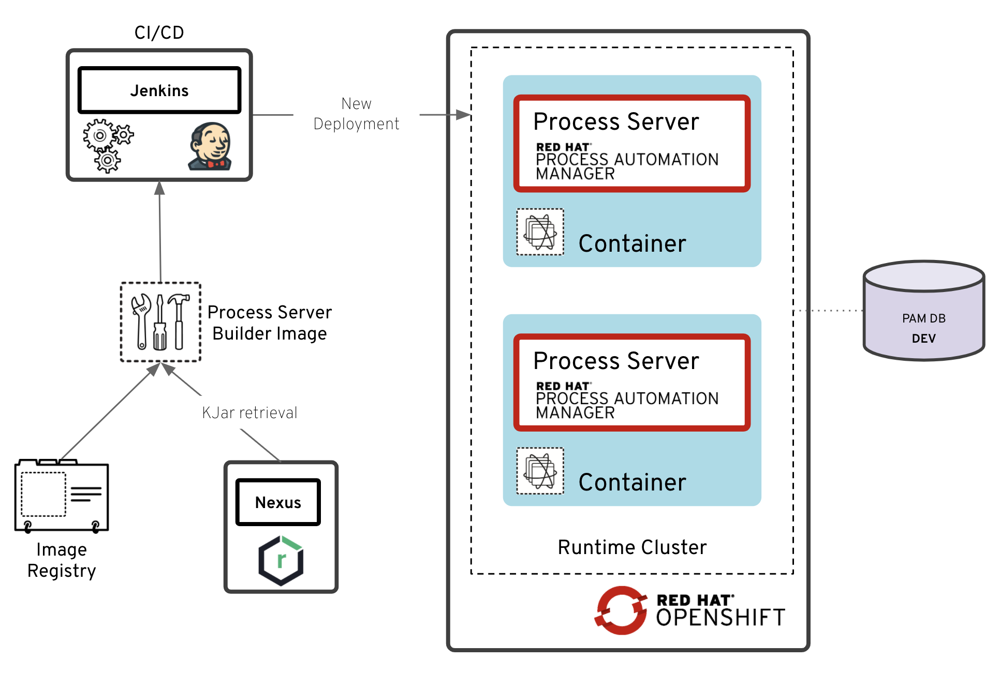

VA Perspecta

Red Hat Process Automation Manager

Proposed Solution

V2.0

March/April 2020

[[TOC]]

# Presentation

The goal of this document is to capture the architecture around Red Hat Process Automation Manager (PAM) 7 that is best suited for Perspecta's BPM use cases. It results from 3 sessions around PAM which took place in March and April 2020. 

It also suggests some recommendations and best practices around PAM in order to meet Perspecta's requirements as well as their customers' ones.

# Document control information

Version: **2.0**

Document Author(s):

<table>
  <tr>
    <td>Author's name</td>
    <td>Role</td>
  </tr>
  <tr>
    <td>Richard Bourner</td>
    <td>Red Hat Business Automation Senior Architect</td>
  </tr>
</table>

Document Reviewer(s):

<table>
  <tr>
    <td>Reviewer's name</td>
    <td>Role</td>
  </tr>
  <tr>
    <td>Rob Caruso</td>
    <td></td>
  </tr>
  <tr>
    <td>Tim Merkt</td>
    <td></td>
  </tr>
  <tr>
    <td>Carlos Ruiz</td>
    <td></td>
  </tr>
  <tr>
    <td>Sergio Shen</td>
    <td></td>
  </tr>
</table>

# RHPAM and Openshift

Perspecta will be deploying Red Hat PAM 7 on Openshift 3.11.  Run-time invocation on business processes instances will be available using a REST API, accessing microservices once the units of deployment (typically KJAR files) have been successfully deployed.

Figure 1 - *PAM typical run-time*

# Environments

## Internal environments

Perspecta has the following environments on which RHPAM's software components will be deployed:

* **MANAGED**  -  Environment for CI/CD tooling

* **DEV**  -  Development environment

* **TESTING/STAGING**  -  Testing environment

* **DEMO**  -  Internal PROD environment

## Customers' environments

In addition to these internal environments, Perspecta's customers will also have their own environments dedicated to PAM's usage.  Which ones precisely will be discussed and identified later on.

# Build and Deployment

PAM's unit of deployment is a JAR file also known as **KJAR** (K is for Knowledge). Each KJAR file contains one or more business processes and business rules as well as additional information, including Maven-specific information for deployment.

It is up to the users to define how many KJARs are to be created and which business processes must be packaged within each KJAR. Each KJAR will, after deployment onto a Process Execution Server, offer a list of microservices, callable via a REST API (the list of APIs is available via Swagger: http://<server>:<port>/kie-server/docs).  

Since KJARs are versioned (using Maven versioning capabilities), a KJAR has its own life-cycle, independent from other KJARs, and independent from the client applications which will consume the business processes.

Perspecta will use a CI/CD process for deployments, and will follow a promotion approach as described in the following diagram. Promotion will be automated as much as possible, using dedicated CI/CD Jenkins pipelines.

The following diagram shows Perspecta's environments and the path procedure between them.

# 

Figure 2 - *Promotion path across environments*

Perspecta's interaction with their customers's environments and the deployment paths and provisioning in particular is yet to be identified.  The following diagram shows a possible deployment path process across different environments:

Figure 3 - *Prospecta's deployment to their customers*

Different CI/CD Jenkins pipelines will be set up to match these deployments' requirements.

Note that business processes will not have REST services end-point parameterized as part of the design process, because a DNS server will be in charge to call the proper URL, depending on the environment the processes are deployed to.

# PAM Architecture

RHPAM 7 features 2 main components to de deployed:

* **Business Central** - the business processes and business rules authoring environment

* **Process Execution Server** - the run-time environment for business processes and business rules

Other optional components described further in this document may be deployed if needed.

## Design Time Architecture

Perspecta is not sure if they are going to use Business Central for their authoring environment. For now, Trisotech (not part of Red Hat distribution) has been used for a POC and the creation of a POC KJAR.  Business Central will be set up anyway for Perspecta in a dedicated Openshift cluster.

Whether Business Central or Trisotech (or both) is (are) going to be used, all KJAR files resulting from the build will be pushed onto the Nexus repository in order to be available for deployment onto recipient run-time environments.

The following diagram describes this process, which could be automated in a dedicated pipeline.

Figure 4 - *Design-time *

Some additional steps may be included in this diagram, including to describe how process designs (i.e. **.bpmn** files) will be worked on before being pushed to GIT.  In order for the KJAR generation to be successful at build-time, not only the BPMN files must contain all the information required at run-time, but the structure of the GIT project needs to be compliant to what PAM expects (typically a proper POM file, a valid tree structure, etc.) during the build process.

## Run-Time Architecture

Processes are executed within PAM Process Server instances. A dedicated web application is provided as part of PAM distribution: Process Execution Server (aka KieServer).  Note that KieServer application has no User Interface. It is meant to communicate via REST APIs.

These run-time servers and the microservices corresponding to the deployed processes may be accessed via dedicated REST APIs. 

As business processes' execution may live a long time on the server side, depending on the number of asynchronous tasks designed in each of them (including human tasks), it requires a  stateful behavior and the run-time status of these processes must be persisted in a dedicated storage (usually a database).  PAM provides a database schema for storing all processes' run-time information, whether they are alive, completed or aborted.

KJAR files are PAM's unit of deployment.  Once KJAR files are stored in the Nexus repository after the build process, they are ready to be deployed to run-time environments.  Immutable images are best suited in a context of container images (Openshift for that matter) and for CI/CD pipelines. 

The following diagram shows how new Openshift pods can be created (eventually via an automation procedure) in order to deploy microservices for new (or new versions) of processes. When deploying on Openshift 3, a template will be used to build immutable images to create these pods on all environments. 

Figure 5 - *Run-time Process Servers Provisioning using Immutable images*

## Authoring Environment

Business Central is a web application dedicated to centralize the authoring of business processes and business rules.  This application usually doesn't require high-availability, nor has scalability requirements.  It has been designed and built so that different types of profiles can use it: developers, business analysts, PAM administrators, business processes and business rules owners, etc.

Perspecta has mentioned that Business Central may not be needed due to the following reasons:

* Business processes are currently designed using Trisotech authoring tools

* Business rules will not be authored within PAM tooling and will not be packaged along with the business processes and will have their own life-cycle. They will be invoked at run-time from the business processes via dedicated services tasks using REST end-points 

* If business processes (typically *.bmpm* XML files) need to be tampered, this will be done as part of an automation procedure, either by modifying the XML file directly, or by using the PAM Java API for this.  The required steps still need to be identified precisely.

If Business Central is going to be used, a GIT repository local to the corresponding pod will be used to store all projects' artefacts (i.e. business processes, business rules, POM file, descriptors, etc.).  In order to keep this repository in sync with Perspecta's GitHub repository (which may be defined as "the source of truth"), a GitHook mechanism may be set up. 

### Design

Business processes will be split into separate projects. Any project in the GIT repository will be deployed as a separate KJAR file which will be versioned using Maven. Business requirements and process life-cycles will drive the decisions about how to split all business processes across multiple projects (and therefore multiple KJAR files).

# Installation

As previously mentioned, PAM will be deployed on Openshift 3.11.  For this, dedicated Openshift templates will be used, provided as part of PAM distribution (available from Red Hat's portal).  

When Perspecta switches to Openshift 4, other options for setup will be available, such as using Operators. For information about Operators, refer to the following:

* Openshift 4 Operators:  [https://access.redhat.com/documentation/en-us/openshift_container_platform/4.3/html-single/operators/index](https://access.redhat.com/documentation/en-us/openshift_container_platform/4.3/html-single/operators/index)

* Operators for PAM on Openshift 4: [https://access.redhat.com/documentation/en-us/red_hat_process_automation_manager/7.7/html-single/deploying_a_red_hat_process_automation_manager_environment_on_red_hat_openshift_container_platform_using_operators/index](https://access.redhat.com/documentation/en-us/red_hat_process_automation_manager/7.7/html-single/deploying_a_red_hat_process_automation_manager_environment_on_red_hat_openshift_container_platform_using_operators/index)

## Types of provisioning

PAM provides different ways for installing and provisioning its components, depending on the target environments. Business Central and Process Execution Server may be installed differently. This section describes the different options, along with some recommendations.

### Authoring environment 

Business Central will be installed on Openshift in Perspecta's MANAGED environment. The installation procedure can be found here:

[https://access.redhat.com/documentation/en-us/red_hat_process_automation_manager/7.7/html/deploying_a_red_hat_process_automation_manager_authoring_environment_on_red_hat_openshift_container_platform/index](https://access.redhat.com/documentation/en-us/red_hat_process_automation_manager/7.7/html/deploying_a_red_hat_process_automation_manager_authoring_environment_on_red_hat_openshift_container_platform/index) 

### Execution environment 

Process execution server (aka KieServer) will be deployed as immutable containers on Perspecta's Openshift clusters, providing High-Availability (HA) and scalability capabilities.

The **immutable** mode is the recommended approach in a PAM-on-Openshift context as it is best suited for containers' management and for CI/CD integration.

Provisioned servers will be immutable and no additional KJAR deployment or removal can be performed on an existing server. In the case of a deployment of a new KJAR or a new version of an existing KJAR, a new image must be re-built and provisioned in the dedicated Openshift cluster.  

Eventually, out-of-date pods may be retired at one point if the corresponding KJAR version is not used by client applications. If Perspecta and its customers have to deploy often new versions of KJARs, a clean-up mechanism would have to be set up in order to avoid keeping too many unused PAM KieServer pods.

PAM provides a template allowing this immutable mode provisioning: [https://access.redhat.com/jbossnetwork/restricted/softwareDetail.html?softwareId=79521&product=rhpam&version=7.7.0&downloadType=distributions](https://access.redhat.com/jbossnetwork/restricted/softwareDetail.html?softwareId=79521&product=rhpam&version=7.7.0&downloadType=distributions)

The  installation procedure for immutable mode can be found here:

[https://access.redhat.com/documentation/en-us/red_hat_process_automation_manager/7.7/html/deploying_a_red_hat_process_automation_manager_immutable_server_environment_on_red_hat_openshift_container_platform/index](https://access.redhat.com/documentation/en-us/red_hat_process_automation_manager/7.7/html/deploying_a_red_hat_process_automation_manager_immutable_server_environment_on_red_hat_openshift_container_platform/index)

### Type of provisioning

No S2I procedure will not be used in Perspecta's context. Instead, a **binary** deployment will be performed, which means KJAR files information (typically Maven GAV) will be provided to the template to provision an image for the given process(es). 

These KJAR files will need to be previously packaged and stored in Perspecta's Nexus repository.

## PAM Database

PAM requires a database to store processes' runtime information. This database is only used by the run-time server and not by the authoring environment.  

By default, PAM comes with an H2 in-memory database out of the box.  But as H2 is not a recommended database for production environments, Perspecta will be using a PostgreSQL database.

PAM distribution includes different schema scripts depending on the type of database used.  There is usually no need to access this database as the execution server embeds the persistence APIs for runtime process instances.

For one given environment, a single database instance will be set up, even if, for scalability reasons, several pods will be spawn for that environment. Note that the database instances should be shared across environments.

These database schemas can be found here: [https://access.redhat.com/jbossnetwork/restricted/softwareDetail.html?softwareId=79551&product=rhpam&version=7.7.0&downloadType=distributions](https://access.redhat.com/jbossnetwork/restricted/softwareDetail.html?softwareId=79551&product=rhpam&version=7.7.0&downloadType=distributions) 

The version of database used is PostgreSQL V11.5. As defined on Red Hat's portal ([https://access.redhat.com/articles/3405381](https://access.redhat.com/articles/3405381)), the PostgreSQL database version that was used for tests with PAM 7.7 is **10.1 Enterprise**.  

## Smart Router

PAM features an additional optional component, the **Smart Router**, allowing it to act as a proxy to access the process servers at run-time. It is mostly useful for PAM's customers who do not have load-balancing capabilities or want to have multiple versions of the same KJAR files and make the calls transparent to the callers.

Smart Router performs the following tasks:

* Collects information from various server instances in a single client request

* Finds the right server for a specific request

* Aggregates responses from different servers

* Provides efficient load-balancing

* Manages changing environments, for example adding and removing server instances

* Managers registration with the Process Server controller

For additional information about Smart Router, check the following links: 

* [https://access.redhat.com/solutions/3785641](https://access.redhat.com/solutions/3785641)

* [https://access.redhat.com/solutions/3772521](https://access.redhat.com/solutions/3772521)

# Testing

Just like for any software, business processes and business rules should be tested in order to check that they match both business and technical requirements.  

When using BPM and PAM, several levels of testing may be used:

* **Unit testing** - usually local testing using Mock APIs for services and asynchronous tasks.  Unit testing may be implemented using PAM Java local APIs instead of REST APIs ([https://jbpm.org/api-docs/kie-server/paths.html](https://jbpm.org/api-docs/kie-server/paths.html)).

* **Functional testing** - this testing is more oriented towards business requirements and providing non-regression testing is usually a good practice.  It is also recommended to not mix functional testing with functional testing as they serve different purposes.

* **Integration testing** - to test the connectivity between the microservices resulting from the deployment of KJAR files and the applications which will consume them. Typically, REST invocations are being used, either using standard Java REST API ([https://access.redhat.com/documentation/en-us/red_hat_process_automation_manager/7.7/html-single/interacting_with_red_hat_process_automation_manager_using_kie_apis/index#kie-server-java-api-con_kie-apis](https://access.redhat.com/documentation/en-us/red_hat_process_automation_manager/7.7/html-single/interacting_with_red_hat_process_automation_manager_using_kie_apis/index#kie-server-java-api-con_kie-apis)), or by using PAM Java remote client APIs.

* **Performance testing** - simulating a large volume of transactions is essential to make sure that no issue will be encountered after deploying to production. Creating large scale scenarios simulating real-world BPM scenarios may be created for this.

* **Robustness testing** - similar to performance testing, but focus more on robustness of the PAM setup rather than performance.

# Monitoring and Tracing

Monitoring and tracing business processes and business rules at run-time may be important. PAM offers different ways to answer requirements about this:

* REST API - PAM remote REST APIs allow to fetch at any time information about processes instances. 

* DB - all run-time information related to business processes is stored in the dedicated database. Note that it is not recommended to tamper directly the PAM database tables, neither its structures nor its data. Two sets of tables are created:

    * Tables for completed process instances (Audit/History)

    * Tables for running process instances

* Prometheus -  this open source monitoring toolkit may be used with PAM. Couple with a UI such as Grafana, allow to provide process monitoring capabilities. More for information, refer to:  [https://access.redhat.com/documentation/en-us/red_hat_process_automation_manager/7.7/html-single/managing_and_monitoring_kie_server/index#prometheus-monitoring-con_execution-server](https://access.redhat.com/documentation/en-us/red_hat_process_automation_manager/7.7/html-single/managing_and_monitoring_kie_server/index#prometheus-monitoring-con_execution-server)

* Listeners - PAM features a set of listeners provided as Java interfaces which can be implemented in order to be notified by the process engines as events get submitted during process instances get executed.  Custom Java coding is required as these listeners are specific to customers' requirements.  Examples of use cases for these listeners are tracing/logging, pushing information to a JMS queue, persisting data to an additional database, etc.  Listeners must be built and packaged in separate projects and provided as a Maven dependency to the main projects.  The list of available listeners are:

    * Process event listener - to be notified about business processes execution

    * Business rules event listeners - to be notified about business rules firing

    * Process task event listener - to be notified about tasks life-cycle within business processes, typically human tasks 

# Acronyms and Terminology

<table>
  <tr>
    <td>Acronym</td>
    <td>Definition/Meaning</td>
  </tr>
  <tr>
    <td>API</td>
    <td>Application Programming Interface </td>
  </tr>
  <tr>
    <td>BC</td>
    <td>Business Central</td>
  </tr>
  <tr>
    <td>BPM</td>
    <td>Business Process Modeling</td>
  </tr>
  <tr>
    <td>CD</td>
    <td>Continuous Deployment</td>
  </tr>
  <tr>
    <td>CI</td>
    <td>Continuous Integration</td>
  </tr>
  <tr>
    <td>DB</td>
    <td>Database</td>
  </tr>
  <tr>
    <td>DNS</td>
    <td>Domain Name System</td>
  </tr>
  <tr>
    <td>EAP</td>
    <td>Red Hat JBoss Enterprise Application Platform</td>
  </tr>
  <tr>
    <td>HA</td>
    <td>High Availability</td>
  </tr>
  <tr>
    <td>JAR</td>
    <td>Java ARchive File</td>
  </tr>
  <tr>
    <td>JVM</td>
    <td>Java Virtual Machine</td>
  </tr>
  <tr>
    <td>KJAR</td>
    <td>Knowledge Java ARchive File</td>
  </tr>
  <tr>
    <td>OCP</td>
    <td>Red Hat Openshift Container Platform</td>
  </tr>
  <tr>
    <td>PAM</td>
    <td>Red Hat Process Automation Manager</td>
  </tr>
  <tr>
    <td>POM</td>
    <td>Project Object Model</td>
  </tr>
  <tr>
    <td>REST</td>
    <td>REpresentational State Transfer</td>
  </tr>
  <tr>
    <td>SCM</td>
    <td>Source Code Management</td>
  </tr>
  <tr>
    <td>S2I</td>
    <td>Source to Image</td>
  </tr>
  <tr>
    <td>UI</td>
    <td>User Interface</td>
  </tr>
  <tr>
    <td>URL</td>
    <td>Uniform Resource Locator</td>
  </tr>
  <tr>
    <td>VM</td>
    <td>Virtual Machine</td>
  </tr>
</table>

